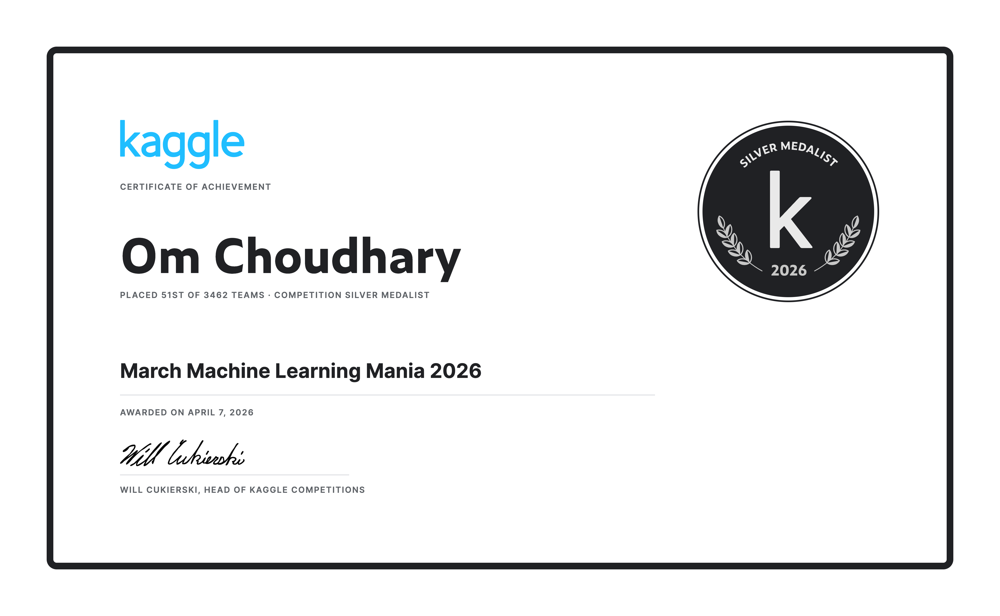

  

<h1 align="center">Hi, I'm Om 👋</h1>

AI/ML Technical Lead building foundation model, scientific AI, and production AI systems from research to deployment

🧬 Foundation Models • 🔬 Pretraining Research • 🎨 Scientific AI • 🧠 Multimodal AI • ⚡ GPU Inference • 📊 Distributed ML

---

## 🚀 Quick Highlights

🥈 **Kaggle March Machine Learning Mania 2026 Silver Medal**  
Ranked **51st out of 3,462 teams**

🧬 **Foundation Model Pretraining**  
Focused on color, spectra, materials appearance, masked spectral modeling, DeltaE evaluation, objective ablations, scaling configs, and failure analysis.

🏆 **EB-1 Extraordinary Ability Recipient**

📚 **First-author publications**
- Nature Structural & Molecular Biology
- JACS
- Journal of Molecular Biology
- PLOS ONE

💡 **Inventor on Machine Learning & Computer Vision Patents**

---

## 📸 Featured Achievement

  

<b>Kaggle March Machine Learning Mania 2026 — Silver Medal</b>

---
## 🧠 What I Build

| Foundation Models | Scientific AI | Pretraining Systems |
|------------------|---------------|---------------------|
| Masked modeling | Spectral learning | Objective ablations |
| Multimodal models | Color science | Scaling experiments |
| Evaluation harnesses | Materials appearance | Metric logging |
| Agentic systems | DeltaE / CIEDE2000 | Failure analysis |
---

## 🌟 Featured Projects

### 🏥 Ambient Multimodal Clinical AI

Speech transcription + handwriting OCR + retrieval + clinical reasoning.

**Tech:** Whisper, OCR, RAG, FastAPI

---

### 🥈 March Mania 2026 Silver Medal

Ensemble learning, feature engineering, pseudo-labeling, tournament prediction.

**Tech:** Python, XGBoost, ML

---

### 🧠 NVIDIA Nemotron Reasoning Lab

Reasoning-focused LLM workflows, LoRA fine-tuning, evaluation, and inference experimentation.

**Tech:** Nemotron, PyTorch, LoRA

---

### 🎧 BirdCLEF Audio AI

Bioacoustic soundscape classification and environmental audio understanding.

**Tech:** Audio ML, PyTorch

---

## 🛠️ Tech Stack

**AI / ML**

`PyTorch` `TensorFlow` `XGBoost` `Scikit-Learn`

**LLMs**

`RAG` `LoRA` `Fine-Tuning` `Evaluation`

**Infrastructure**

`FastAPI` `Docker` `Kubernetes` `Databricks` `Spark`

**Inference**

`CUDA` `TensorRT` `ONNX`

---

## 📈 Current Focus

- Agentic AI systems
- Ambient AI workflows
- LLM evaluation & observability
- GPU inference optimization
- Developer productivity agents

---

## 🎯 Why This GitHub Exists

Most repositories here represent systems built to solve real-world problems.

Topics you'll find across this profile:

- Agentic AI
- Ambient AI
- Audio AI
- Multimodal AI
- Distributed ML
- GPU Inference
- Applied Research

The goal isn't to showcase notebooks.

The goal is to showcase systems.

---

<b>Production AI systems, not just model demos.</b>

