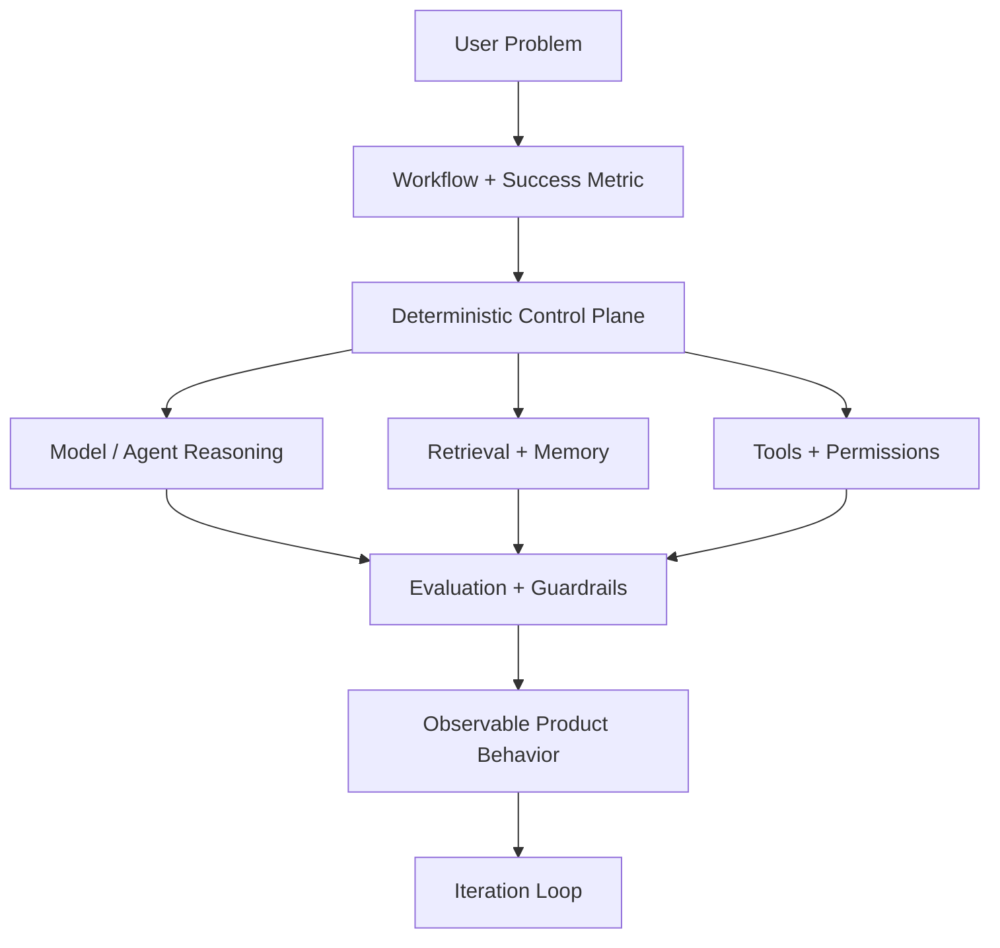

<!--
Profile README for github.com/OmieChoudhary
Create a public repository named exactly: OmieChoudhary
Place this README.md at the root of that repository.
-->

  

  
  
  
  

<h1 align="center">Production AI systems, not just model demos.</h1>

I build AI systems that move from ambiguous idea to measurable product impact: **agentic workflows, multimodal AI, RAG, audio/NLP systems, clinical AI prototypes, and edge inference pipelines**.

My background spans healthcare, fintech, manufacturing, scientific ML, and enterprise AI. I like the hard middle layer: the place where models need routing, permissions, retrieval, memory, observability, evaluation, latency budgets, and safe fallback paths before they can become useful products.

> The model is rarely the whole product. The system around it is where reliability is won.

---

## ⚡ What I Build

| Theme | What it means in practice |
|---|---|
| **Agentic AI** | Deterministic control planes, tool orchestration, routing, permissions, memory, human escalation |
| **Multimodal AI** | Audio, text, image, handwriting, OCR, and vision-language pipelines |
| **Ambient AI** | Clinical-style assistants that combine transcription, entity extraction, retrieval, and structured reasoning |
| **Audio AI** | Bioacoustic soundscape classification, event detection, evaluation, blending, and inference workflows |
| **RAG + NLP** | Retrieval pipelines, vector search, hallucination checks, evidence extraction, and eval harnesses |
| **Edge Inference** | ONNX, TensorRT, Triton-style serving, CUDA-aware optimization, latency-focused deployment |
| **Distributed ML** | Spark, Kafka-style pipelines, scalable preprocessing, large data workflows, production MLOps |

---

## 🧭 Featured Portfolio Map

These repositories are organized so a recruiter can immediately understand the AI surface area.

<table>
  <tr>
    <td width="50%">
      <h3>🩺 Ambient Multimodal Clinical AI</h3>
      
<b>Category:</b> Ambient AI · Multimodal AI · Audio/NLP · OCR · Clinical AI

      
Prototype system combining audio transcription, handwritten-note extraction, multimodal fusion, and FastAPI serving patterns.

      
<b>Repo:</b> <code>ambient-multimodal-clinical-ai</code>

    </td>
    <td width="50%">
      <h3>🐦 BirdCLEF Bioacoustic Soundscape AI</h3>
      
<b>Category:</b> Audio AI · Bioacoustics · Sound Event Detection · Deep Learning · Kaggle

      
Audio classification toolkit for bird soundscape modeling, target generation, macro AUC evaluation, ensembling, and reproducible inference workflows.

      
<b>Repo:</b> <code>birdclef-bioacoustic-soundscape-ai</code>

    </td>
  </tr>
  <tr>
    <td width="50%">
      <h3>🤖 Deterministic Agentic CX</h3>
      
<b>Category:</b> Agents · RAG · Customer Experience · Safety · Orchestration

      
Reference architecture for production agent systems where routing, permissions, retrieval, memory, and escalation are explicit system components.

      
<b>Status:</b> coming next

    </td>
    <td width="50%">
      <h3>🛠️ Agentic PR Workflow Lab</h3>
      
<b>Category:</b> Developer Agents · GitHub Automation · Jira Workflow · Tool Use

      
Mock Jira-to-GitHub workflow where an agent receives a ticket, creates a plan, opens a PR, and links the work back to the issue trail.

      
<b>Status:</b> coming next

    </td>
  </tr>
</table>

---

## 📌 Selected Impact

> Numbers over narratives. Systems over screenshots.

| Impact Area | Example Work |
|---|---|
| **Production agent systems** | Designed multi-agent workflow patterns with deterministic routing, retrieval, permissions, escalation, and observability. |
| **Multimodal AI** | Built pipelines spanning speech, vision, text, and handwriting for applied AI use cases. |
| **Inference optimization** | Worked on latency-sensitive AI systems using ONNX/TensorRT-style deployment, batching, memory management, and edge-aware design. |
| **Scientific + clinical ML** | Built ML systems across healthcare, molecular simulation, medical imaging, and clinical text/audio workflows. |
| **Research depth** | First-author scientific publication record, patent contributions, and EB-1 recognition. |

---

## 🧰 Technical Stack

  
  
  
  
  
  
  
  
  
  

**AI systems:** LLMs, RAG, vector search, agent orchestration, multimodal fusion, evaluation, observability  
**ML/Deep Learning:** PyTorch, Transformers, audio classification, OCR, computer vision, tabular ML  
**Serving:** FastAPI, Docker, REST APIs, async workflows, model-serving patterns  
**Infrastructure:** Spark, Kafka-style event pipelines, Postgres, CI/CD, cloud/GPU deployment patterns  
**Optimization:** ONNX, TensorRT concepts, batching, quantization, latency profiling, edge inference

---

## 🧪 How I Think About AI Products

The core question I ask is not “Can the model answer this?”  
It is: **Can the system do this reliably, repeatedly, safely, and measurably?**

---

## 🧑‍🔬 Beyond Code

I come from a scientific computing background, so I am comfortable translating messy domain problems into computational systems. I have worked across molecular modeling, medical imaging, clinical workflows, materials science, fintech AI, and enterprise automation.

That mix is why I enjoy AI engineering: the best systems are not just clever models. They are domain understanding, data pipelines, latency constraints, UX, measurement, and engineering discipline all tied together.

---

  <b>Currently organizing my public portfolio around production AI systems:</b> 
  Agentic AI · Ambient AI · Audio AI · Multimodal ML · RAG · Edge Inference · Distributed ML

  

